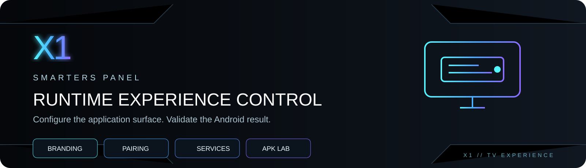
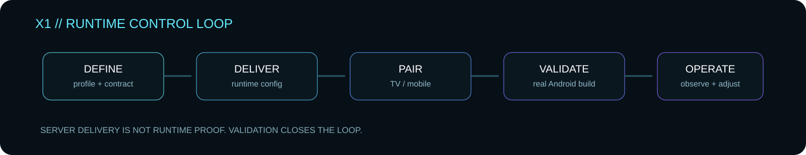
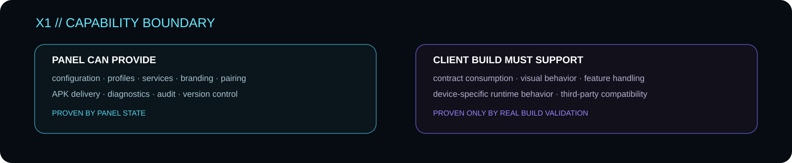

<p align="center">
  
</p>

<p align="center">
  <strong>PUBLIC · FREE · SELF-HOSTED</strong><br>
  Runtime configuration and application-management tooling for compatible Smarters-family builds.
</p>

---

## X1 Smarters Panel v1.3

X1 Smarters Panel is a self-hosted control surface for managing compatible application builds from one place.

It brings together device visibility, runtime configuration, branding, pairing, service integrations, APK handling, diagnostics and administrative controls without turning the public release into a deliberately crippled demo.

> **Free means functional.**
> The public X1 release is intended to be useful as released.

<p align="center">
  
</p>

## What the panel controls

- Device registry, rules, profiles and bulk actions
- Runtime/application configuration
- APK Contract Lab and APK Lab
- Android Validation workflow
- DNS Handshake Lab
- TV / mobile pairing
- Branding controls
- VPN configuration
- Sports integrations
- Advertising controls
- Announcements, reports and feedback
- APK upload, version history and rollback
- Backup / restore
- Migration Assistant
- Diagnostics and health checks
- Alerts and notifications
- Owner / Admin / Operator / Read Only roles
- TOTP 2FA
- Telegram notifications and secure bot commands
- Discord, signed HTTPS webhooks and email integrations

The administration interface supports **English and Portuguese**.

---

<p align="center">
  
</p>

## Runtime truth

A configuration existing in the panel does **not** prove that every historical, third-party or modified application build consumes it correctly.

The panel can prove what it stores and delivers. Real Android behavior must be validated against the exact client build and device.

That is why X1 separates:

**panel state** → what the server is configured to provide  
**runtime proof** → what the real application actually does

Use Android Validation before treating a feature as production-proven.

---

## Requirements

- PHP 8.1+
- OpenSSL
- Apache or Nginx
- writable `data/`, `uploads/` and `backups/`
- HTTPS recommended
- PHP cURL recommended for external integrations
- PHP ZipArchive for ZIP migration
- PHP SQLite3 for legacy SQLite extraction

## Public package

The public PHP build is conservatively minified/obfuscated. It does not rely on `eval`, encoded runtime loaders or unpackers as a security boundary.

GitHub stores the binary package in three parts under `release/`.

### Linux / macOS

```bash
cd release
chmod +x assemble-linux-macos.sh
./assemble-linux-macos.sh
```

### Windows

Run:

```text
release\assemble-windows.cmd
```

The resulting archive is:

`X1_SMARTERS_PANEL_v1.3_PUBLIC_CLEAN_OBFUSCATED.tar.bz2`

Published SHA-256:

`64ed75e560dc752080d65a19fb69c9c40178a915c6cf3995a69df3609997178b`

## Installation

1. Assemble and extract the public package.
2. Ensure `data/`, `uploads/` and `backups/` are writable.
3. Open `install.php`.
4. Create the Owner account.
5. Open Diagnostics.
6. Configure the compatible application contract and services.
7. Validate the exact Android build before production use.

Main application endpoint:

`api/api.php`

Logo and intro media are intentionally not bundled in the lightweight public archive. Upload them from **Branding** after installation.

---

## Operating model

**DEFINE → DELIVER → PAIR → VALIDATE → OPERATE**

The goal is not merely to send configuration. The goal is to close the loop between desired configuration and observed application behavior.

---

## Community

- Telegram: https://t.me/+XkuQS_QuD6g4Nzc0
- Forum: https://forum.x1panel.space
- Discord: https://discord.gg/vSSw6jHmw

---

<p align="center">
  <strong>CONFIGURE THE EXPERIENCE.</strong><br>
  <strong>DELIVER THE STATE.</strong><br>
  <strong>VALIDATE THE BUILD.</strong><br><br>
  <strong>X1 // TV EXPERIENCE</strong>
</p>

<p align="center">
  Copyright © 2026 X1Tech Solutions SA. All Rights Reserved.
</p>
